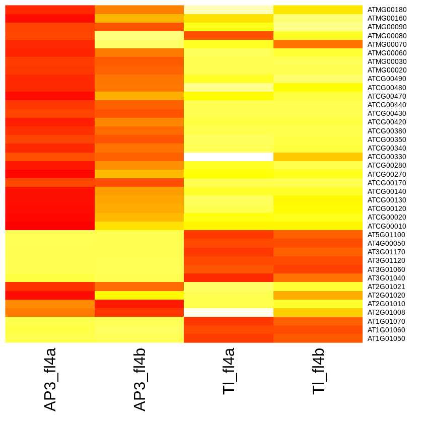
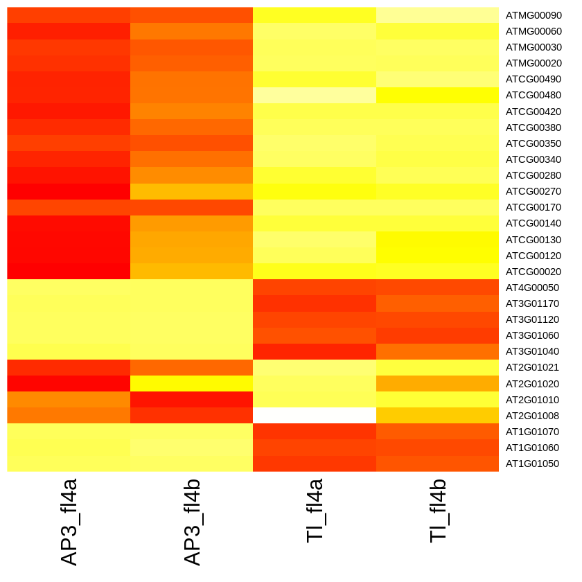
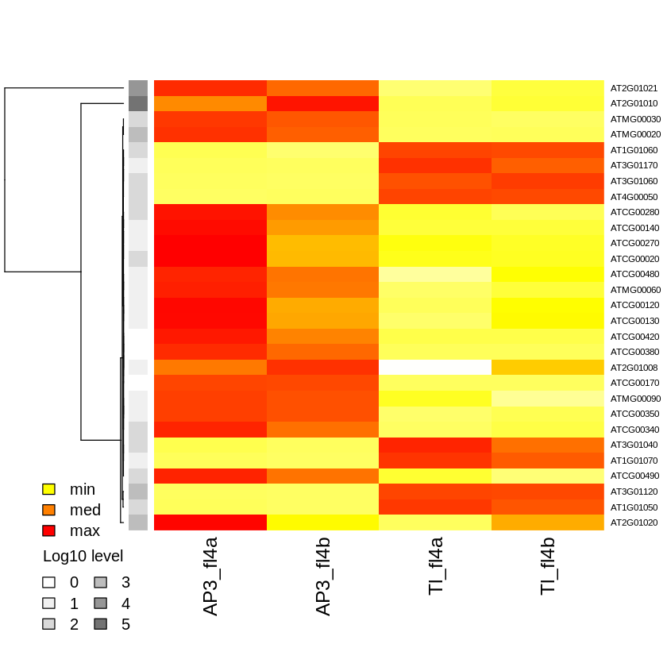
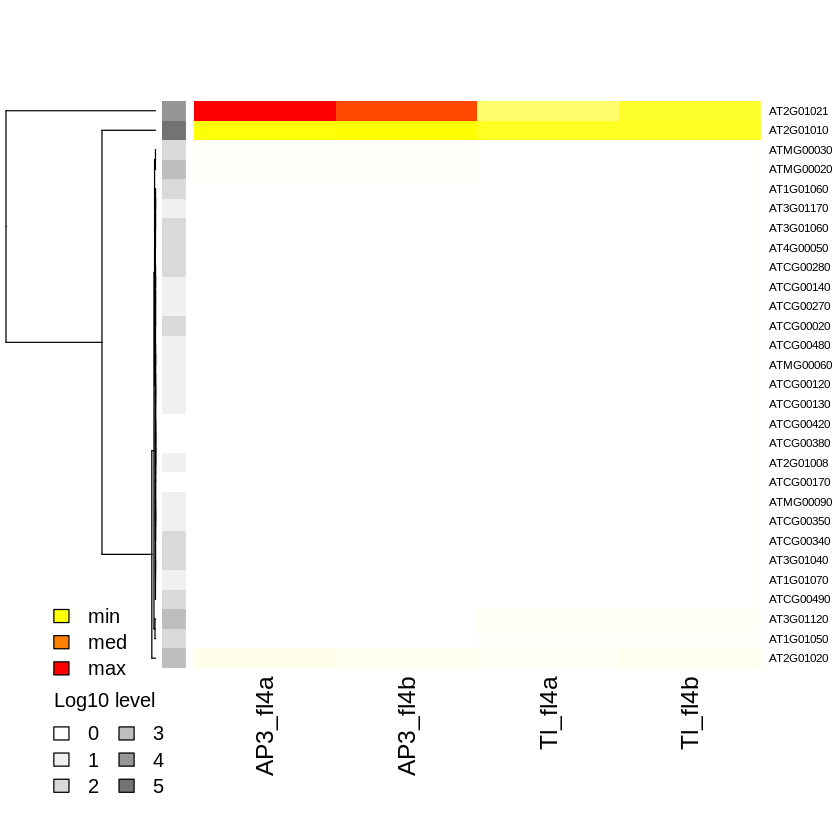

# Lab 3: heatmaps and clustergrams

We will explore generating some heatmaps, and heatmaps with clustergrams in this part of the lab. We’ll use a “translatome” RNA-seq dataset from a part of a developing Arabidopsis flower as a test dataset, with RNA-seq data from the whole flower translatome as a control sample. 

# 2. Loading packages and data

As for last week’s lab, we’ll load some packages that will help us with our goal of creating some plots this week.


```R
# Packages to help tidy our data
library (tidyverse)
# Packages for the graphical analysis section
library (repr)
# packages used for loading data from Excel
library (readxl)

```

    Warning message:
    “replacing previous import ‘ellipsis::check_dots_unnamed’ by ‘rlang::check_dots_unnamed’ when loading ‘tibble’”
    Warning message:
    “replacing previous import ‘ellipsis::check_dots_used’ by ‘rlang::check_dots_used’ when loading ‘tibble’”
    Warning message:
    “replacing previous import ‘ellipsis::check_dots_empty’ by ‘rlang::check_dots_empty’ when loading ‘tibble’”
    Registered S3 methods overwritten by 'tibble':
      method     from  
      format.tbl pillar
      print.tbl  pillar
    
    ── Attaching packages ─────────────────────────────────────── tidyverse 1.3.0 ──
    
    ✔ ggplot2 3.3.0     ✔ purrr   1.0.1
    ✔ tibble  3.0.1     ✔ dplyr   1.1.0
    ✔ tidyr   1.3.0     ✔ stringr 1.5.0
    ✔ readr   1.3.1     ✔ forcats 0.5.0
    
    ── Conflicts ────────────────────────────────────────── tidyverse_conflicts() ──
    ✖ dplyr::filter() masks stats::filter()
    ✖ dplyr::lag()    masks stats::lag()
    


```R
# read in FPKM-summarized expression data from an Excel file
expression_data.df <- read_excel("rpkmDFeByg_new.xlsx", sheet=1)
str(expression_data.df)

# read in an output from DESeq2 for our experiment, with an added column of log10 of average expression value
DEGs.df <- read_excel("DEGs.xlsx", sheet=1)
str(DEGs.df)

```

    New names:
    • `` -> `...1`


    tbl_df [145 × 5] (S3: tbl_df/tbl/data.frame)
     $ ...1    : chr [1:145] "AT1G01010" "AT1G01020" "AT1G01030" "AT1G01040" ...
     $ AP3_fl4a: num [1:145] 52.57 141.22 4.57 131.86 67.24 ...
     $ AP3_fl4b: num [1:145] 24.082 68.744 0.854 87.88 62.842 ...
     $ Tl_fl4a : num [1:145] 393.1 520.9 80.9 500.1 57.2 ...
     $ Tl_fl4b : num [1:145] 369.2 294.3 57.5 451.1 244.1 ...


    New names:
    • `` -> `...1`


    tbl_df [145 × 8] (S3: tbl_df/tbl/data.frame)
     $ ...1            : chr [1:145] "AT1G01010" "AT1G01020" "AT1G01030" "AT1G01040" ...
     $ AP3_TRL_baseMean: num [1:145] 50.42 87.67 7.98 345.81 5.57 ...
     $ AP3_TRL_logFC   : num [1:145] -0.873 0.509 -2.28 0.369 1.241 ...
     $ AP3_TRL_lfcSE   : chr [1:145] "0.53971517532179103" "0.44626080509107102" "1.36532230617628" "0.245600414864767" ...
     $ AP3_TRL_stat    : chr [1:145] "-1.61801685846127" "1.14098613980372" "-1.6695858376403001" "1.5015181645092699" ...
     $ AP3_TRL_pvalue  : chr [1:145] "0.105658964567623" "0.25387569083294897" "9.50013343606564E-2" "0.13322159208748199" ...
     $ AP3_TRL_FDR     : num [1:145] 0.154 0.302 0.148 0.181 0.462 ...
     $ Log_level       : chr [1:145] "1" "1" "0" "2" ...


# 4. Merging datasets

In order to be able to filter genes based on significance values, we’re going to merge the data frame containing expression values with the one containing significance levels (generated DESeq2, as discussed in the lecture) using the AGI ID as a “key” to do so. The AGI IDs are found in an unlabeled column, which was renamed to “…1” when the data were imported from Excel into the respective data frames in the previous step


```R
# merging signifance values (FDRs) in DEG list into our
# expression_data data frame
expression_data_w_FDR.df <- merge(expression_data.df, DEGs.df, by.x = "...1", by.y = "...1", all.x = TRUE, all.y = TRUE)
str(expression_data_w_FDR.df)

```

    'data.frame':	145 obs. of  12 variables:
     $ ...1            : chr  "AT1G01010" "AT1G01020" "AT1G01030" "AT1G01040" ...
     $ AP3_fl4a        : num  52.57 141.22 4.57 131.86 67.24 ...
     $ AP3_fl4b        : num  24.082 68.744 0.854 87.88 62.842 ...
     $ Tl_fl4a         : num  393.1 520.9 80.9 500.1 57.2 ...
     $ Tl_fl4b         : num  369.2 294.3 57.5 451.1 244.1 ...
     $ AP3_TRL_baseMean: num  50.42 87.67 7.98 345.81 5.57 ...
     $ AP3_TRL_logFC   : num  -0.873 0.509 -2.28 0.369 1.241 ...
     $ AP3_TRL_lfcSE   : chr  "0.53971517532179103" "0.44626080509107102" "1.36532230617628" "0.245600414864767" ...
     $ AP3_TRL_stat    : chr  "-1.61801685846127" "1.14098613980372" "-1.6695858376403001" "1.5015181645092699" ...
     $ AP3_TRL_pvalue  : chr  "0.105658964567623" "0.25387569083294897" "9.50013343606564E-2" "0.13322159208748199" ...
     $ AP3_TRL_FDR     : num  0.154 0.302 0.148 0.181 0.462 ...
     $ Log_level       : chr  "1" "1" "0" "2" ...


```R
# create a subset of genes that have an FDR rate of less 
# than 10% and 2-fold change or more
FDR10.df <- subset(expression_data_w_FDR.df, AP3_TRL_FDR < .1 & abs(AP3_TRL_logFC) > 1)
str(FDR10.df)
```

    'data.frame':	39 obs. of  12 variables:
     $ ...1            : chr  "AT1G01050" "AT1G01060" "AT1G01070" "AT2G01008" ...
     $ AP3_fl4a        : num  506.3 117.8 9.6 37.9 411532.7 ...
     $ AP3_fl4b        : num  4.30e+02 6.64e+01 4.49 4.72e+01 4.43e+05 ...
     $ Tl_fl4a         : num  9.14e+03 1.26e+03 3.68e+02 9.56 3.72e+05 ...
     $ Tl_fl4b         : num  8016.3 1231.8 307.8 27.2 374844.6 ...
     $ AP3_TRL_baseMean: num  557.1 288 27.6 17 263389.8 ...
     $ AP3_TRL_logFC   : num  -1.68 -1.3 -3.13 3.69 2.74 ...
     $ AP3_TRL_lfcSE   : chr  "0.227843473058809" "0.27032295360339598" "0.78856419343981798" "1.09109855922976" ...
     $ AP3_TRL_stat    : chr  "-7.3882259379243402" "-4.79945985093718" "-3.96296839030328" "3.38129247841835" ...
     $ AP3_TRL_pvalue  : chr  "1.48800745101812E-13" "1.59094124013596E-6" "7.4023585877406505E-5" "7.2145705223796797E-4" ...
     $ AP3_TRL_FDR     : num  1.17e-12 7.48e-06 2.90e-04 2.51e-03 4.17e-38 ...
     $ Log_level       : chr  "2" "2" "1" "1" ...


# 5,6. Filtering to focus on genes with a specified FDR

Often, we would like to generate lists of genes depending on some sort of cut-off. In the following two cases, we’re generating lists of genes and their associated significance values such that the two lists have an FDR better than 10% or 1%, respectively, and a fold-change cut-off of greater than 2-fold “up” or “down”. In the following cell, we prune down our data to just what we need for the heatmap. 


```R
# create a subset of genes that have an FDR rate of less 
# than 1% and 2-fold change or more
FDR1.df <- subset(expression_data_w_FDR.df, AP3_TRL_FDR < .01 & abs(AP3_TRL_logFC) > 1)
str(FDR1.df)
```

    'data.frame':	29 obs. of  12 variables:
     $ ...1            : chr  "AT1G01050" "AT1G01060" "AT1G01070" "AT2G01008" ...
     $ AP3_fl4a        : num  506.3 117.8 9.6 37.9 411532.7 ...
     $ AP3_fl4b        : num  4.30e+02 6.64e+01 4.49 4.72e+01 4.43e+05 ...
     $ Tl_fl4a         : num  9.14e+03 1.26e+03 3.68e+02 9.56 3.72e+05 ...
     $ Tl_fl4b         : num  8016.3 1231.8 307.8 27.2 374844.6 ...
     $ AP3_TRL_baseMean: num  557.1 288 27.6 17 263389.8 ...
     $ AP3_TRL_logFC   : num  -1.68 -1.3 -3.13 3.69 2.74 ...
     $ AP3_TRL_lfcSE   : chr  "0.227843473058809" "0.27032295360339598" "0.78856419343981798" "1.09109855922976" ...
     $ AP3_TRL_stat    : chr  "-7.3882259379243402" "-4.79945985093718" "-3.96296839030328" "3.38129247841835" ...
     $ AP3_TRL_pvalue  : chr  "1.48800745101812E-13" "1.59094124013596E-6" "7.4023585877406505E-5" "7.2145705223796797E-4" ...
     $ AP3_TRL_FDR     : num  1.17e-12 7.48e-06 2.90e-04 2.51e-03 4.17e-38 ...
     $ Log_level       : chr  "2" "2" "1" "1" ...


```R
# create new data frame with just expression values of FDR10 or FDR1 genes
top_FDR10.df <- FDR10.df[ , c(1,2,3,4,5)]
str(top_FDR10.df)
top_FDR1.df <- FDR1.df[ , c(1,2,3,4,5)]
str(top_FDR1.df)

```

    'data.frame':	39 obs. of  5 variables:
     $ ...1    : chr  "AT1G01050" "AT1G01060" "AT1G01070" "AT2G01008" ...
     $ AP3_fl4a: num  506.3 117.8 9.6 37.9 411532.7 ...
     $ AP3_fl4b: num  4.30e+02 6.64e+01 4.49 4.72e+01 4.43e+05 ...
     $ Tl_fl4a : num  9.14e+03 1.26e+03 3.68e+02 9.56 3.72e+05 ...
     $ Tl_fl4b : num  8016.3 1231.8 307.8 27.2 374844.6 ...
    'data.frame':	29 obs. of  5 variables:
     $ ...1    : chr  "AT1G01050" "AT1G01060" "AT1G01070" "AT2G01008" ...
     $ AP3_fl4a: num  506.3 117.8 9.6 37.9 411532.7 ...
     $ AP3_fl4b: num  4.30e+02 6.64e+01 4.49 4.72e+01 4.43e+05 ...
     $ Tl_fl4a : num  9.14e+03 1.26e+03 3.68e+02 9.56 3.72e+05 ...
     $ Tl_fl4b : num  8016.3 1231.8 307.8 27.2 374844.6 ...


# 7. Generating a heatmap

In order to generate a heatmap, we can use the built-in heatmap function of R. It requires a data matrix, not a data frame, and we can generate that with the as.matrix() function.


```R
# the heatmap function requires a data matrix
m <- (as.matrix(top_FDR10.df[, -1]))
rownames(m) <- top_FDR10.df$...1
heatmap(m, Colv=NA, Rowv=NA, col=rev(heat.colors(256)), mar = c(8, 6))

```





```R
m <- (as.matrix(top_FDR1.df[, -1]))
rownames(m) <- top_FDR1.df$...1
heatmap(m, Colv=NA, Rowv=NA, col=rev(heat.colors(256)),  mar = c(8, 6))

```





# 9. Clustering and adding a sidebar to provide additional info

We’ll use that additional column to create an additional visual cue as to the overall level of expression of our genes, as the default behaviour of the heatmap function is to normalize the levels in each row – this means within a row you can easily see high and low expression levels, but you can’t directly compare expression levels between rows. We'll cluster by rows by omitting the Rowv=NA parameter in the heatmap() function.


```R
# let's add a sidebar with colours denoting baseMean (~average) expression level, after log10-transformation
# We'll cluster by rows by excluding the Rowv = NA parameter
library(RColorBrewer) # we explored this library in Lab 1! 
my_group <- as.numeric(FDR1.df[FDR1.df$...1 %in% rownames(m), "Log_level"])

# You need to add 1 when selecting colour groups as our log_level values can range from 0 .. n
colSide <- brewer.pal(9, "Greys")[my_group + 1]
heatmap(m, Colv=NA, RowSideColors=colSide, col=rev(heat.colors(256)), scale = "row")

# Calculate the min, median, and max values
val_range <- c(min(m), median(m), max(m))

# Change the margins of the plot (the first is the bottom margin)
par(mar = c(6, 4.1, 4.1, 2.1), xpd=TRUE)

# Plot a corresponding legend for colour range
legend(x=-0.1, y = 0.2, legend=c("min", "med", "max"),fill=rev(heat.colors(3)), bty="n")

# Make the legend for the log_level of base mean expression
log_legend <- data.frame(log_level = unique(my_group), 
                         log_col = unique(colSide), 
                         stringsAsFactors = FALSE) %>% 
# Sort ascending by log level
arrange(log_level)

legend(x=-0.1, y=0.05, 
       legend=log_legend$log_level, fill=log_legend$log_col, 
       title = "Log10 level", bty="n", ncol = 2)

```





```R
# let's add a sidebar with colours denoting  baseMean (~average) expression level, after log10-transformation
# We'll cluster by rows by excluding the Rowv = NA parameter
library(RColorBrewer)
# my_group <- as.numeric(as.factor(substr(rownames(m), 1 , 3)))
my_group <- as.numeric(FDR1.df[FDR1.df$...1 %in% rownames(m), "Log_level"])

# You need to add 1 when selecting colour groups as our log_level values can range from 0 .. n
colSide <- brewer.pal(9, "Greys")[my_group + 1]
heatmap(m, Colv=NA, RowSideColors=colSide, col=rev(heat.colors(256)), scale = "none")

# Calculate the min, median, and max values
val_range <- c(min(m), median(m), max(m))

# Change the margins of the plot (the first is the bottom margin)
par(mar = c(6, 4.1, 4.1, 2.1), xpd=TRUE)

# Plot a corresponding legend for colour range
# legend(x="bottomright", inset=c(-0.1,-0.15), legend=c("min", "med", "max"),fill=rev(heat.colors(3)), bty="n")
legend(x=-0.1, y = 0.2, legend=c("min", "med", "max"),fill=rev(heat.colors(3)), bty="n")

# Make the legend for the log_level of base mean expression
log_legend <- data.frame(log_level = unique(my_group), 
                         log_col = unique(colSide), 
                         stringsAsFactors = FALSE) %>% 
# Sort ascending by log level
arrange(log_level)

legend(x=-0.1, y=0.05, 
       legend=log_legend$log_level, fill=log_legend$log_col, 
       title = "Log10 level", bty="n", ncol = 2)

```





```R

```
